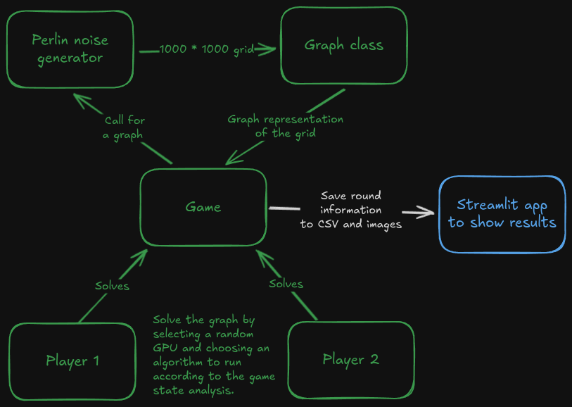
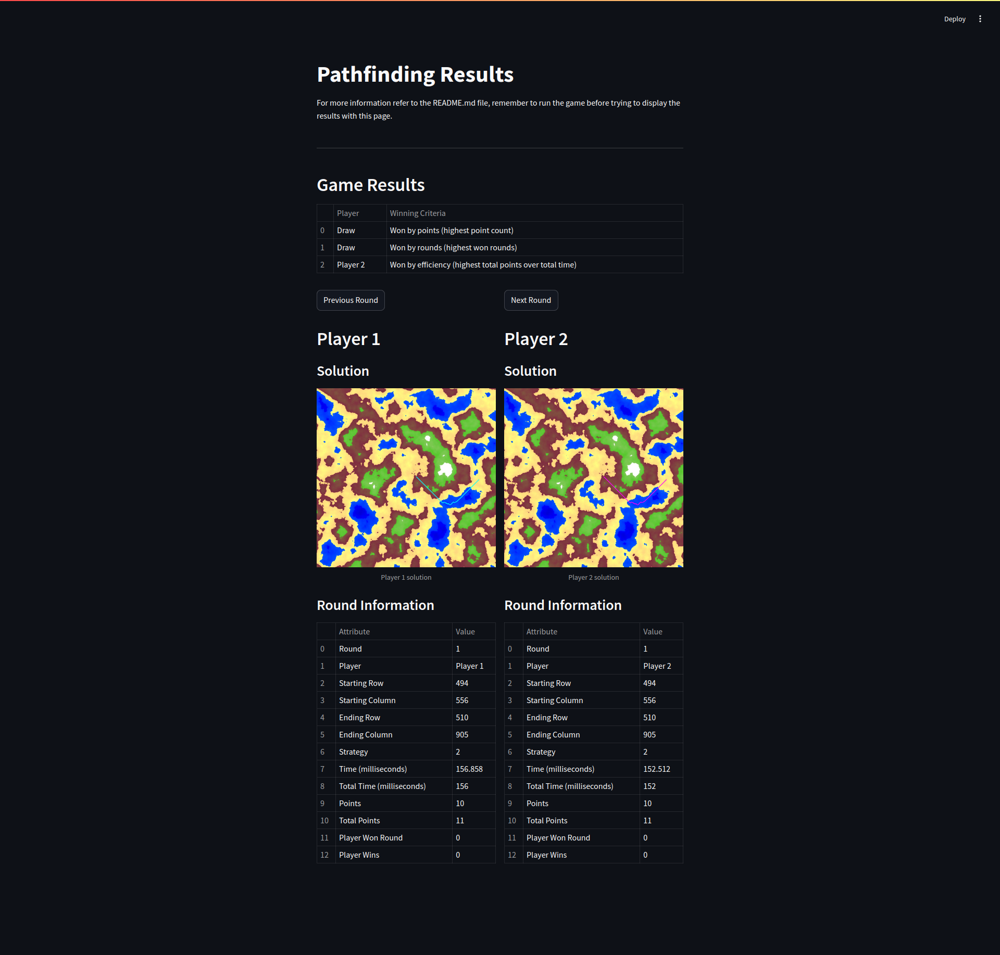

# Competing Pathfinding Algorithms


> OpenAI. (2024). A visually dynamic illustration of a competition between pathfinding algorithms.

## Overview

The current project is a collection of three different pathfinding algorithms, two of them accelerated or implemented on top of CUDA, this was created as an assignment in the course "CUDA at Scale for the Enterprise", the assignment was to create a CUDA "game" where two agents compete using different GPUs, in my case I decided to create a pathfinding competition. The main idea is that two agents choose one of the algorithms (strategy) via exploration and exploration analysis and then solve a pathfinding problem on a grid, the grid (or map) is a 2D matrix created via a Perlin noise generator, the agents have to find the shortest path from the start point to the end point, the project workflow is as follows:



First, the game benchmarks each of the available pathfinding algorithms, which are:

- FFP: Flow Field Pathfinding (accelerated with CUDA)
- DCP: Dijkstra's algorithm (CPU)
- DCU: Dijkstra's Algorithm (CUDA)

All algorithms return the same result, as Flow Field is basically the same as Dijkstra's algorithm.

At the beginning, each algorithm is benchmarked using the best available GPU and classified into best, average, and worst according to the time taken by each algorithm. Usually DCP performs the best, this is explained by comments on the code, followed by FFP, and DCU which performs the worst, the reasons for DCU's performance can be further studied in the attached paper[^1]; this behavior is expected according to the O-complexity of each.

Then the game calls for a graph in each round, the graph is generated using a grid of size 1'000 * 1'000, resulting in 1'000'000 nodes with at least 4 neighbors, then a random start and end point is determined and the round is set for the agents to play.

The agents will choose an strategy (best, average or worst performing algorithm) based on the state of the game, they will be reward points according to the algorithm chosen:

| Strategy |      Points granted      |
|:--------:|:------------------------:|
| Best     | +10                      |
| Average  | +20                      |
| Worst    | +30 - (time taken / 100) |

Once the points are awarded, the round results are stored and the game continues until a certain number of rounds have been played. When the game is finished, the results can be visualized using a Streamlit application, which displays the game results, the path found by the agents, the time taken by each algorithm, and other relevant information.

## Building and Running the Project

To run the project, the NVIDIA CUDA Toolkit must be installed. The compilation process is handled with CMake as follows:

```bash
# Clone the repository
# Navigate to the project directory
mkdir build
cd build
cmake ..
make
./pathfinding
```

The above will give this expected output:

```
Benchmarking strategies...
Run 1...
Run 2...
Run 3...
Best strategy: 2 with an average time of 119 milliseconds.
Average strategy: 1 with an average time of 261 milliseconds.
Worst strategy: 3 with an average time of 415 milliseconds.

Round 1...
Player 1: 2...
Player 1: 2 with 10 points.
Player 2: 2...
Player 2: 2 with 10 points.

...
```

Once the game is finished, the Streamlit application can be run as follows:

```bash
# Move to the analysis directory
python3 -m venv env
source env/bin/activate
pip install -r requirements.txt
streamlit run main.py
```

Which will open a browser window:



[^1]: Martín, P. J., Torres, R., & Gavilanes, A. (2009). CUDA solutions for the SSSP problem. In Lecture notes in computer science (pp. 904–913). https://doi.org/10.1007/978-3-642-01970-8_91
